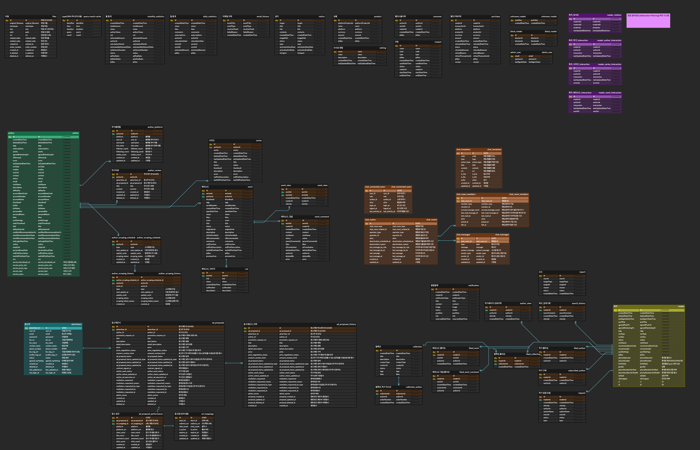

# KROW Chat Server Information

```
- Node : 22.1x
- Cloud : AWS EC2
- Cloud OS : Ubuntu 22.04 LTS amd64
- DataBase : AWS RDS(MySQL 8)
- Framwork : NestJS
- WebSocket : websockets 11.1.3 / socket.io 11.1.3
- ORM : TypeORM 11.0.0
- Logger : Winston
- CI/CD : Docker + GitAction
```

### Notice

- 현재 개발계만 작성 되어 있습니다. 추후 운영측 배포가 필요합니다.
  - 추후 운영측 서버 신규 개설시 동일 환경 구축 할 경우 ubuntu-init.sh 파일 참고 부탁드립니다.
- 운영측 DB 정보는 Krow 측에 요청 부탁드립니다.
- DockerHub 경우 Krow 측에 계정 요청하여 수정 후 진행 부탁드립니다.

## Start Script

```json
  "scripts": {
    "build": "nest build",
    "format": "prettier --write \"src/**/*.ts\" \"test/**/*.ts\"",
    "start": "nest start",
    "start:dev": "nest start --watch",
    "start:debug": "nest start --debug --watch",
    "start:prod": "node dist/main",
    "lint": "eslint \"{src,apps,libs,test}/**/*.ts\" --fix",
    "test": "jest",
    "test:watch": "jest --watch",
    "test:cov": "jest --coverage",
    "test:debug": "node --inspect-brk -r tsconfig-paths/register -r ts-node/register node_modules/.bin/jest --runInBand",
    "test:e2e": "jest --config ./test/jest-e2e.json"
  },
```

## DB ERD

</img>

## CI/CD

```
Location : .github/workflows/depoly-dev.yml

```

### GitAction Secret

```
DOCKER_USERNAME
DOCKER_ACCESS_TOKEN
EC2_HOST_DEV
EC2_USERNAME
EC2_PRIVATE_KEY
EC2_PORT
DB_TYPE_DEV
DB_HOST_DEV
DB_PORT_DEV
DB_USERNAME_DEV
DB_PASSWORD_DEV
DB_NAME_DEV
ACCESS_TOKEN_SECRET
AWS_SECRET_ACCESS_KEY
AWS_ACCESS_KEY_ID
AWS_REGION
AWS_S3_BUCKET_NAME
```

## Architecture Pattern

```
- Modular Architecture
- Domain-Driven Design
- Layerd Design
```

## File Structure

```bash
chat-server/
├── env.example
├── package.json
├── Dockerfile
├── README.md
├── nest-cli.json
├── tsconfig.json
├── src/
│   ├── main.ts
│   ├── app.module.ts
│   ├── app.controller.ts
│   ├── app.service.ts
│   ├── config/
│   │   ├── db/
│   │   │   └── mysql.module.ts
│   │   ├── env/
│   │   │   └── env.module.ts
│   │   ├── entity/
│   │   │   ├── Response.entity.ts
│   │   │   └── Validation.entity.ts
│   │   ├── exception/
│   │   │   └── ... (custom exception files)
│   │   ├── interceptor/
│   │   │   └── response.intercepetor.ts
│   │   ├── log/
│   │   │   ├── log-file.interceptor.ts
│   │   │   ├── log-http.interceptor.ts
│   │   │   ├── log-ws.interceptor.ts
│   │   │   ├── log.module.ts
│   │   │   └── log.util.ts
│   │   ├── openapi/
│   │   │   ├── decorator/
│   │   │   ├── dto/
│   │   │   └── swagger.setup.ts
│   │   └── type/
│   │       ├── socket.types.ts
│   │       └── user-payload.type.ts
│   ├── domain/
│   │   ├── auth/
│   │   │   ├── auth.module.ts
│   │   │   ├── auth.service.ts
│   │   │   ├── decorator/
│   │   │   ├── enums/
│   │   │   ├── guard/
│   │   │   ├── interceptor/
│   │   │   └── interface/
│   │   ├── chat/
│   │   │   ├── chat.gateway.ts
│   │   │   ├── chat.module.ts
│   │   │   ├── dto/
│   │   │   │   ├── get-chat-room.dto.ts
│   │   │   │   ├── request/
│   │   │   │   ├── response/
│   │   │   │   ├── update-chat-room-last-message.dto.ts
│   │   │   │   ├── update-chat-room-member-last-read-message.dto.ts
│   │   │   │   └── update-chat-room-member-unread-message-count.dto.ts
│   │   │   ├── entity/
│   │   │   ├── enums/
│   │   │   ├── interceptor/
│   │   │   ├── interface/
│   │   │   ├── servcie/
│   │   │   │   ├── chat-connection.service.ts
│   │   │   │   ├── chat-message.service.ts
│   │   │   │   ├── chat-room-member.service.ts
│   │   │   │   ├── chat-room.service.ts
│   │   │   │   ├── chat-templates.service.ts
│   │   │   │   ├── chat.service.ts
│   │   │   │   └── socket-emit.service.ts
│   │   │   ├── socket-helper.controller.ts
│   │   │   ├── type/
│   │   │   └── util/
│   │   ├── event/
│   │   │   ├── enums/
│   │   │   ├── event.module.ts
│   │   │   ├── listener/
│   │   │   └── request/
│   │   ├── file/
│   │   │   ├── entity/
│   │   │   ├── enums/
│   │   │   ├── file.controller.ts
│   │   │   ├── file.module.ts
│   │   │   ├── interface/
│   │   │   ├── repository/
│   │   │   ├── request/
│   │   │   ├── response/
│   │   │   ├── service/
│   │   │   └── util/
│   │   └── user/
│   │       ├── entity/
│   │       ├── enums/
│   │       ├── service/
│   │       └── user.module.ts
│   └── test/
│       ├── app.e2e-spec.ts
│       └── jest-e2e.json
├── log/
└── ... (기타 설정/환경 파일)
```

## Configuration(ENV)

```
# Package : @nestjs/config + join
# Location : src/config/env/env.module.ts
```

## Logging

```
Package : winston + winston-daily-rotate-file
Location : src/config/log
Utility : src/config/log/log.util.ts
Interceptor
 src/config/log/log-file.interceptor.ts
 src/config/log/log-http.interceptor.ts
 src/config/log/log-ws.interceptor.ts
```

### Using Logger Interceptor Example

```ts
// Using Class Decorator
// WebSocket Log Interceptor
@WebSocketGateway()
@UseInterceptors(LogWebSocketInterceptor)
export class ChatGateway {}

// Using Method Decorator
// HTTP / File Log Interceptor
export class Controller {
  @ApiConsumes('multipart/form-data')
  @UseInterceptors(LogFileInterceptor)
  multipartApi() {}

  @UseInterceptors(LogHttpInterceptor)
  @ApiConsumes('Not multipart/form-data')
  notMultipartApi() {}
}
```

### WebSocket Structure

```
┌─────────┐     ┌─────────┐     ┌────────────┐
│ GateWay │ ──→ │ Service │ ──→ │ Repository │
└─────────┘     └─────────┘     └────────────┘
```

### WebSocket

#### Directory Structure

```
// WebSocket Gateway
src/domain/chat/chat.gateway.ts
// 채팅 관련 서비스 계층
src/domain/chat/servcie/*.ts
// WebSocket 요청/응답 DTO
src/domain/chat/dto/*.ts
// 이벤트 타입, 에러 코드 등
src/domain/chat/enums/*.ts
// WebSocket 응답 인터페이스 등
src/domain/chat/interface/*.ts
// 이벤트 매핑, 핸들러 매핑 등
src/domain/chat/type/*.ts
// 이벤트 매핑 유틸리티
src/domain/chat/util/*.ts
```

#### Refer Files

```
// 이벤트 타입 정의
src/domain/chat/enums/chat-event-type.enum.ts

// 이벤트 매핑/핸들러
src/domain/chat/type/event-payload.map.ts
src/domain/chat/type/handler-event.map.ts
```

## Chat Information

### Chat Entities

```
// 시스템 메세지 템플릿
src/domain/chat/entity/ChatTemplates.entity.ts
// 접속 유저 정보
src/domain/chat/entity/ChatConnectedUsers.entity.ts
// 채팅 룸
src/domain/chat/entity/ChatRooms.entity.ts
// 채팅 룸 멤버
src/domain/chat/entity/ChatRoomMembers.entity.ts
// 채팅 메세지
src/domain/chat/entity/ChatMessages.entity.ts
```

### Chat Entities DDL

```sql
-- 채팅 연결 유저 테이블
DROP TABLE IF EXISTS `chat_connected_users`;
CREATE TABLE `chat_connected_users` (
  id VARCHAR(36) NOT NULL COMMENT 'UUID',
  user_id VARCHAR(36) NOT NULL COMMENT '유저 아이디',
  role VARCHAR(255) NOT NULL COMMENT '유저 타입',
  socket_id VARCHAR(255) NULL COMMENT '소켓 아이디',
  alive BOOLEAN NOT NULL COMMENT '활성화 여부',
  login_at DATETIME NOT NULL COMMENT '로그인 시간',
  logout_at DATETIME COMMENT '로그아웃 시간',
  last_activity_at DATETIME COMMENT '마지막 활동 시간',
  CONSTRAINT `PK_chat_connected_users` PRIMARY KEY (id),
  INDEX `IDX_chat_connected_users_user_id` (user_id),
  INDEX `IDX_chat_connected_users_socket_id` (socket_id)
) ENGINE=InnoDB DEFAULT CHARSET=utf8mb4 COLLATE=utf8mb4_general_ci COMMENT='채팅 연결 유저';

-- 채팅방 테이블
CREATE TABLE `chat_rooms` (
  `id` CHAR(36) NOT NULL COMMENT 'UUID',
  `chat_room_type` ENUM('AD_PROPOSAL') NOT NULL COMMENT '채팅방 타입',
  `chat_room_related_id` CHAR(36) NOT NULL COMMENT '채팅방 연관 ID',
  `operator_type` ENUM('ADVERTISER', 'AUTHOR', 'ADMIN') NOT NULL COMMENT '채팅방 생성자 타입',
  `operator_id` CHAR(36) NOT NULL COMMENT '채팅방 생성자 ID',
  `alive` BOOLEAN NOT NULL COMMENT '채팅방 활성화 여부',
  `deactivation_scheduled_at` TIMESTAMP NULL COMMENT '채팅방 비활성화 예약 시간',
  `deactivation_reason` VARCHAR(255) NULL COMMENT '채팅방 비활성화 예약 사유',
  `last_message_by_role` ENUM('ADVERTISER', 'AUTHOR', 'ADMIN') NULL COMMENT '마지막 메시지 보낸 사람 타입',
  `last_message_by_id` CHAR(36) NULL COMMENT '마지막 메시지 보낸 사람 ID',
  `last_message` TEXT NULL COMMENT '마지막 메시지',
  `last_message_at` TIMESTAMP NULL COMMENT '마지막 메시지 시간',
  `created_at` TIMESTAMP NOT NULL DEFAULT CURRENT_TIMESTAMP COMMENT '생성일',
  `updated_at` TIMESTAMP NOT NULL DEFAULT CURRENT_TIMESTAMP ON UPDATE CURRENT_TIMESTAMP COMMENT '수정일',
  PRIMARY KEY (`id`),
  INDEX `FK_chat_rooms_related_table` (chat_room_type, chat_room_related_id),
  INDEX `FK_chat_rooms_operator_id` (operator_type, operator_id)
) ENGINE=InnoDB DEFAULT CHARSET=utf8mb4 COLLATE=utf8mb4_general_ci COMMENT='채팅방 테이블';

-- 채팅 참여자 테이블
CREATE TABLE `chat_room_members` (
  `id` CHAR(36) NOT NULL COMMENT 'UUID',
  `chat_room_id` CHAR(36) NOT NULL COMMENT '채팅방 ID',
  `member_type` ENUM('ADVERTISER', 'AUTHOR', 'ADMIN') NOT NULL COMMENT '채팅 참여자 타입',
  `member_id` CHAR(36) NOT NULL COMMENT '채팅 참여자 ID',
  `unread_message_count` INT NOT NULL DEFAULT 0 COMMENT '채팅 참여자 읽지 않은 메시지 수',
  `last_read_message_id` CHAR(36) NULL COMMENT '채팅 참여자 마지막 읽은 메시지 ID',
  `last_read_at` TIMESTAMP NULL COMMENT '채팅 참여자 마지막 읽은 시간',
  `alive` BOOLEAN NOT NULL COMMENT '채팅 참여자 활성화 여부',
  `joined_at` TIMESTAMP NOT NULL COMMENT '채팅 참여자 가입 시간',
  `left_at` TIMESTAMP NULL COMMENT '채팅 참여자 탈퇴 시간',
  PRIMARY KEY (`id`),
  INDEX `FK_chat_room_members_chat_room_id` (chat_room_id),
  INDEX `FK_chat_room_members_member_id` (member_type, member_id)
) ENGINE=InnoDB DEFAULT CHARSET=utf8mb4 COLLATE=utf8mb4_general_ci COMMENT='채팅 참여자 테이블';

-- 채팅 메시지 테이블
CREATE TABLE `chat_messages` (
  `id` CHAR(36) NOT NULL COMMENT 'UUID',
  `chat_room_id` CHAR(36) NOT NULL COMMENT '채팅방 ID',
  `type` ENUM('TEXT', 'FILE', 'SYSTEM') NOT NULL COMMENT '메시지 타입',
  `message` TEXT NULL COMMENT '메시지',
  `system_message` TEXT NULL COMMENT '시스템 메시지',
  `sender_type` ENUM('ADVERTISER', 'AUTHOR', 'ADMIN') NOT NULL COMMENT '메시지 보낸 사람 타입',
  `sender_id` CHAR(36) NOT NULL COMMENT '메시지 보낸 사람 ID',
  `created_at` TIMESTAMP NOT NULL DEFAULT CURRENT_TIMESTAMP COMMENT '생성일',
  `updated_at` TIMESTAMP NOT NULL DEFAULT CURRENT_TIMESTAMP ON UPDATE CURRENT_TIMESTAMP COMMENT '수정일',
  PRIMARY KEY (`id`),
  INDEX `FK_chat_messages_chat_room_id` (chat_room_id),
  INDEX `FK_chat_messages_sender_id` (sender_type, sender_id)
) ENGINE=InnoDB DEFAULT CHARSET=utf8mb4 COLLATE=utf8mb4_general_ci COMMENT='채팅 메시지 테이블';

-- 채팅 템플릿 테이블
CREATE TABLE `chat_templates` (
  `id` char(36) NOT NULL COMMENT 'UUID',
  `code` varchar(100) NOT NULL COMMENT '채팅 템플릿 코드',
  `type` varchar(100) NOT NULL COMMENT '채팅 템플릿 타입',
  `action_type` varchar(100) NOT NULL COMMENT '채팅 템플릿 액션 타입',
  `title` varchar(100) NOT NULL COMMENT '채팅 템플릿 제목',
  `content` text NOT NULL COMMENT '채팅 템플릿 내용',
  `url` varchar(512) DEFAULT NULL COMMENT '채팅 템플릿 링크',
  `is_link` tinyint(1) DEFAULT FALSE COMMENT '링크 여부',
  `is_file` tinyint(1) DEFAULT FALSE COMMENT '파일 여부',
  `order` int(11) DEFAULT NULL COMMENT '파일 순서',
  `created_at` timestamp NOT NULL DEFAULT CURRENT_TIMESTAMP COMMENT '생성일',
  `updated_at` timestamp NOT NULL DEFAULT CURRENT_TIMESTAMP ON UPDATE CURRENT_TIMESTAMP COMMENT '수정일',
  PRIMARY KEY (`id`)
) ENGINE=InnoDB DEFAULT CHARSET=utf8mb4 COLLATE=utf8mb4_general_ci COMMENT='채팅 템플릿 테이블';
```

## System Message (Using Chat Template)

### Using Controller

```ts
// Location : src/domain/system-message/system-message.controller.ts
export class SystemMessageController {}
```

### System Message Data Flow

```
┌───────────┐     ┌────────────┐     ┌────────────┐     ┌───────┐     ┌───────────┐
│ Other API │ ──→ │ ChatServer │ ──→ │ Controller │ ──→ │ Event │ ──→ │ Socket.io │
└───────────┘     └────────────┘     └────────────┘     └───────┘     └───────────┘
```

### Init Data

```sql
INSERT INTO instatoon_dev.chat_templates (code,`type`,action_type,title,content,url,is_link,is_file,`order`,created_at,updated_at) VALUES
	 ('ADVERTISER_AD_PROPOSAL_MESSAGE','TEMPLATE','','[광고명]','[회사명]님이 제안서를 전송했어요.
제안서는 아래 버튼을 누르거나 제안 메뉴에서 확인할 수 있어요.',NULL,0,0,0,NOW(),NOW()),
	 ('ADVERTISER_AD_PROPOSAL_MESSAGE','NOTICE','NOTICE','','제안서의 내용은 작가님과 회사 모두 수정할 수 있어요.
수정하고 싶은 내용이 있다면 충분한 협의 후 수정해주세요!',NULL,0,0,0,NOW(),NOW()),
	 ('ADVERTISER_AD_PROPOSAL_UPDATE_MESSAGE','TEMPLATE','','제안을 수정했어요.','[회사명]님이 제안서를 수정했어요.
제안서는 아래 버튼을 누르거나 제안 메뉴에서 확인할 수 있어요.',NULL,0,0,0,NOW(),NOW()),
	 ('ADVERTISER_AD_PROPOSAL_UPDATE_MESSAGE','NOTICE','NOTICE','','제안서의 내용은 작가님과 회사 모두 수정할 수 있어요.
수정하고 싶은 내용이 있다면 충분한 협의 후 수정해주세요!',NULL,0,0,0,NOW(),NOW()),
	 ('AUTHOR_AD_PROPOSAL_ACCEPT_MESSAGE','TEMPLATE','','제안을 수락했어요','[작가명]님이 제안을 수락했습니다.
최종 제안서를 검토하신 후 이상이 없다면 제안 수락 버튼을 눌러주세요!',NULL,0,0,0,NOW(),NOW()),
	 ('AUTHOR_AD_PROPOSAL_ACCEPT_MESSAGE','NOTICE','WARNING','','제안을 수락하면 더이상 수정할 수 없습니다.',NULL,0,0,0,NOW(),NOW()),
	 ('ADVERTISER_AD_PROPOSAL_ACCEPTED_MESSAGE','TEMPLATE','','제안을 수락했어요','[회사명]님이 제안서를 수정했습니다.
영업일 1~2일 이내로 등록한 이메일을 통해 계약서가 발송됩니다.',NULL,0,0,0,NOW(),NOW()),
	 ('ADVERTISER_AD_PROPOSAL_ACCEPTED_MESSAGE','NOTICE','ALERT','','계약은 회사→작가 순으로 수락이 진행됩니다.',NULL,0,0,0,NOW(),NOW()),
	 ('ADVERTISER_AD_PROPOSAL_REJECTED_MESSAGE','TEMPLATE','','제안을 거절했어요','[회사명]님이 제안을 거절했습니다.
제안을 재개하고 싶으시다면, 협업 작가 리스트에서 새로운 제안을
보내주세요!',NULL,0,0,0,NOW(),NOW()),
	 ('ADVERTISER_AD_PROPOSAL_REJECTED_MESSAGE','NOTICE','NOTICE','','**제안 거절 상태의 채팅방에 조치가 있다면 추가(ex. 7일후 채팅 비활성화)',NULL,0,0,0,NOW(),NOW());
INSERT INTO instatoon_dev.chat_templates (code,`type`,action_type,title,content,url,is_link,is_file,`order`,created_at,updated_at) VALUES
	 ('ADVERTISER_AD_CONTRACT_REQUEST_COMPLETE_MESSAGE','TEMPLATE','','[회사명]님, 계약을 완료해주세요!','이메일로 계약서를 전송했어요.
계약 내용을 확인하신 후, 아래 버튼이나 진행내역을 통해 계약을 진행하세요.',NULL,0,0,0,NOW(),NOW()),
	 ('ADVERTISER_AD_CONTRACT_REQUEST_COMPLETE_MESSAGE','NOTICE','ALERT','','계약은 회사->작가 순으로 수락이 진행됩니다.',NULL,0,0,0,NOW(),NOW()),
	 ('ADVERTISER_AD_CONTRACT_COMPLETE_MESSAGE','TEMPLATE','','[회사명]님이 계약에 동의하였습니다.','[작가명]님이 계약에 동의하시면 최종 계약이 완료됩니다.',NULL,0,0,0,NOW(),NOW()),
	 ('AUTHOR_AD_CONTRACT_REQUEST_COMPLETE_MESSAGE','TEMPLATE','','[작가명]님 계약을 완료해주세요!','이메일로 계약서를 전송했어요
계약 내용을 확인하신 후, 아래 버튼이나 진행내역을 통해 계약을 진행하세요.',NULL,0,0,0,NOW(),NOW()),
	 ('AUTHOR_AD_CONTRACT_COMPLETE_MESSAGE','TEMPLATE','','[작가명]님이 계약에 동의하였습니다.','계약이 완료되었습니다
계약서에 기재된 기한에 맞춰 작업이 진행됩니다.',NULL,0,0,0,NOW(),NOW()),
	 ('AUTHOR_AD_CONTRACT_COMPLETE_MESSAGE','NOTICE','NOTICE','','작업 진행 과정에서 툰어스의 중재가 필요한 경우 하단의 중재요청 버튼을 눌러주세요.',NULL,0,0,0,NOW(),NOW()),
	 ('AUTHOR_AD_CONTRACT_COMPLETE_MESSAGE','BUTTON','FULL','','계약서 보기','[URL 작성 필요]',0,0,0,NOW(),NOW()),
	 ('AUTHOR_AD_CONTRACT_COMPLETE_MESSAGE','BUTTON','FULL','','AI로 레퍼런스 콘티 전달하기','[URL 작성 필요]',0,0,1,NOW(),NOW()),
	 ('AUTHOR_AD_CONTI_WORK_START_NOTICE','TEMPLATE','','[작가명]님 콘티이 콘티 작업을 시작하였습니다.','',NULL,0,1,0,NOW(),NOW()),
	 ('AUTHOR_AD_CONTI_WORK_START_NOTICE','NOTICE','NOTICE','','원하는 콘티가 있다면 <콘티 생성 AI>를 이용해보세요!
자료가 구체적일 수록 작업물의 만족도도 높아질 거에요.',NULL,0,0,0,NOW(),NOW());
INSERT INTO instatoon_dev.chat_templates (code,`type`,action_type,title,content,url,is_link,is_file,`order`,created_at,updated_at) VALUES
	 ('AUTHOR_AD_CONTI_WORK_START_NOTICE','BUTTON','FULL','','콘티 생성 AI 사용하기','[URL 작성 필요]',0,0,0,NOW(),NOW()),
	 ('AUTHOR_AD_CONTI_WORK_CONFIRM_REQUEST','TEMPLATE','','[회사명]님 콘티를 확인해주세요!','수정사항이 있으시다면 수정 요청하기 버튼을 눌러주세요.
이상이 없다면 컨펌하기 버튼을 눌러 다음 작업을 진행하세요.',NULL,0,1,0,NOW(),NOW()),
	 ('AUTHOR_AD_CONTI_WORK_CONFIRM_REQUEST','BUTTON','LEFT','','수정 요청하기','[URL 작성 필요]',0,0,0,NOW(),NOW()),
	 ('AUTHOR_AD_CONTI_WORK_CONFIRM_REQUEST','BUTTON','RIGHT','','컨펌하기','[URL 작성 필요]',0,0,0,NOW(),NOW()),
	 ('ADVERTISER_AD_CONTI_UPDATE_REQUEST','TEMPLATE','','[회사명]님이 수정을 요청했습니다.','[작가명]님이 수정한 파일을 전달하시거나, 오른쪽 작업 내역에서 컨펌하기를 통해 작업을 다시 진행 할 수 있습니다.',NULL,0,0,0,NOW(),NOW()),
	 ('ADVERTISER_AD_CONTI_CONFIRM_COMPLETE','TEMPLATE','','[회사명]님이 콘티 컨펌을 완료하였습니다.','콘티 컨펌이 완료되면 본 작업이 진행 됩니다.',NULL,0,0,0,NOW(),NOW()),
	 ('ADVERTISER_AD_CONTI_CONFIRM_COMPLETE','NOTICE','ALERT','','작가님께서 작업을 시작하시면,알림을 통해 안내드릴 예정입니다.',NULL,0,0,0,NOW(),NOW()),
	 ('AUTHOR_AD_WORK_START_NOTICE','TEMPLATE','','[작가명]님이 작업을 시작하였습니다.','',NULL,0,0,0,NOW(),NOW()),
	 ('AUTHOR_AD_WORK_START_NOTICE','NOTICE','NOTICE','','작업이 완료되면 파일 전달과 함께 최종 컨펌이 진행됩니다.',NULL,0,0,0,NOW(),NOW()),
	 ('AUTHOR_AD_WORK_CONFIRM_REQUEST','TEMPLATE','','[회사명]님 작업물을 확인해주세요!','수정사항이 있으시다면 수정 요청하기 버튼을 눌러주세요.
이상이 없다면 컨펌하기 버튼을 눌러 다음 작업을 진행하세요.',NULL,0,1,0,NOW(),NOW());
INSERT INTO instatoon_dev.chat_templates (code,`type`,action_type,title,content,url,is_link,is_file,`order`,created_at,updated_at) VALUES
	 ('AUTHOR_AD_WORK_CONFIRM_REQUEST','NOTICE','WARNING','','최종 컨펌 이후에는 수정이 어려울 수 있으므로, 신중한 검토 부탁드립니다.',NULL,0,0,0,NOW(),NOW()),
	 ('AUTHOR_AD_WORK_CONFIRM_REQUEST','BUTTON','LEFT','','수정 요청하기','[URL 작성 필요]',0,0,0,NOW(),NOW()),
	 ('AUTHOR_AD_WORK_CONFIRM_REQUEST','BUTTON','RIGHT','','최종 컨펌하기','[URL 작성 필요]',0,0,0,NOW(),NOW()),
	 ('ADVERTISER_AD_WORK_UPDATE_REQUEST','TEMPLATE','','[회사명]님이 수정을 요청했습니다.','[작가명]님이 수정한 파일을 전달하시거나, 오른쪽 작업 내역에서 컨펌하기를 통해 작업을 다시 진행 할 수 있습니다.',NULL,0,0,0,NOW(),NOW()),
	 ('ADVERTISER_AD_WORK_CONFIRM_COMPLETE','TEMPLATE','','[회사명]님이 작업물 컨펌을 완료하였습니다.','작업물 컨펌이 완료되면 본 작업이 진행 됩니다.',NULL,0,0,0,NOW(),NOW()),
	 ('ADVERTISER_AD_WORK_CONFIRM_COMPLETE','NOTICE','ALERT','','작가님께서 작업을 시작하시면,알림을 통해 안내드릴 예정입니다.',NULL,0,0,0,NOW(),NOW()),
	 ('AUTHOR_AD_EXECUTION_COMPLETE','TEMPLATE','','[작가명]님이 광고 집행을 시작하였습니다.','완성된 작업물이 공개되었습니다. 광고의 성과는 상단 메뉴의 대시보드 또는 아래 버튼을 통해 열람할 수 있습니다.',NULL,1,0,0,NOW(),NOW()),
	 ('AUTHOR_AD_EXECUTION_COMPLETE','BUTTON','LEFT','','대시보드로 이동','[URL 작성 필요]',0,0,0,NOW(),NOW()),
	 ('AUTHOR_AD_EXECUTION_COMPLETE','BUTTON','RIGHT','','광고 확인하기','[URL 작성 필요]',0,0,0,NOW(),NOW());
```

### System Template Structure

| Column      | Node     | Content                                                  |
| ----------- | -------- | -------------------------------------------------------- |
| code        |          | 시스템 메세지 구분 코드                                  |
| type        | TEMPLATE | 템플릿 최상위 타입                                       |
|             | NOTICE   | 시스템 메세지 강조 메세지                                |
|             | BUTTON   | 시스템 메세지 버튼                                       |
| action_type | NOTICE   | 일반 강조 메세지<span style='color:gray'>[회색]</span>   |
|             | WARNING  | 경고 강조 메세지<span style='color:red'>[붉은색]</span>  |
|             | ALERT    | 알림 강조 메세지<span style='color:blue'>[푸른색]</span> |
|             | FULL     | 버튼 위치 [전체]                                         |
|             | LEFT     | 버튼 위치 [좌측]                                         |
|             | RIGHT    | 버튼 위치 [우측]                                         |
| is_link     | flag     | 링크유무                                                 |
| is_file     | flag     | 파일유무                                                 |
| order       | number   | 순서                                                     |

### System Template Code

```ts
// 채팅 시스템 메시지 코드
export enum ChatTemplateCode {
  // 광고 제안 챕터
  ADVERTISER_AD_PROPOSAL_MESSAGE = 'ADVERTISER_AD_PROPOSAL_MESSAGE', // 광고 제안 메세지
  ADVERTISER_AD_PROPOSAL_UPDATE_MESSAGE = 'ADVERTISER_AD_PROPOSAL_UPDATE_MESSAGE', // 광고 제안 수정 메세지
  AUTHOR_AD_PROPOSAL_ACCEPT_MESSAGE = 'AUTHOR_AD_PROPOSAL_ACCEPT_MESSAGE', // 광고 제안 수락 메세지
  AUTHOR_AD_PROPOSAL_REJECT_MESSAGE = 'AUTHOR_AD_PROPOSAL_REJECT_MESSAGE', // 광고 제안 거절 메세지
  ADVERTISER_AD_PROPOSAL_ACCEPTED_MESSAGE = 'ADVERTISER_AD_PROPOSAL_ACCEPTED_MESSAGE', // 광고 제안 수락 메세지
  ADVERTISER_AD_PROPOSAL_REJECTED_MESSAGE = 'ADVERTISER_AD_PROPOSAL_REJECTED_MESSAGE', // 광고 제안 거절 메세지

  // 광고 계약 챕터
  ADVERTISER_AD_CONTRACT_REQUEST_COMPLETE_MESSAGE = 'ADVERTISER_AD_CONTRACT_REQUEST_COMPLETE_MESSAGE', // 광고 계약 완료 요청 메세지
  ADVERTISER_AD_CONTRACT_COMPLETE_MESSAGE = 'ADVERTISER_AD_CONTRACT_COMPLETE_MESSAGE', // 광고 계약 완료 메세지
  AUTHOR_AD_CONTRACT_REQUEST_COMPLETE_MESSAGE = 'AUTHOR_AD_CONTRACT_REQUEST_COMPLETE_MESSAGE', // 광고 계약 완료 요청 메세지
  AUTHOR_AD_CONTRACT_COMPLETE_MESSAGE = 'AUTHOR_AD_CONTRACT_COMPLETE_MESSAGE', // 광고 계약 완료 메세지

  // 광고 작업 챕터
  AUTHOR_AD_CONTI_WORK_START_NOTICE = 'AUTHOR_AD_CONTI_WORK_START_NOTICE', // 광고 콘티 작업 시작 알림 메세지
  AUTHOR_AD_CONTI_WORK_CONFIRM_REQUEST = 'AUTHOR_AD_CONTI_WORK_CONFIRM_REQUEST', // 광고 콘티 작업 컨펌 요청 메세지
  ADVERTISER_AD_CONTI_UPDATE_REQUEST = 'ADVERTISER_AD_CONTI_UPDATE_REQUEST', // 광고 콘티 작업 수정 요청 메세지
  ADVERTISER_AD_CONTI_CONFIRM_COMPLETE = 'ADVERTISER_AD_CONTI_CONFIRM_COMPLETE', // 광고 콘티 작업 컨펌 완료 메세지
  AUTHOR_AD_WORK_START_NOTICE = 'AUTHOR_AD_WORK_START_NOTICE', // 광고 작업 시작 알림 메세지
  AUTHOR_AD_WORK_CONFIRM_REQUEST = 'AUTHOR_AD_WORK_CONFIRM_REQUEST', // 광고 작업 컨펌 요청 메세지
  ADVERTISER_AD_WORK_UPDATE_REQUEST = 'ADVERTISER_AD_WORK_UPDATE_REQUEST', // 광고 작업 수정 요청 메세지
  ADVERTISER_AD_WORK_CONFIRM_COMPLETE = 'ADVERTISER_AD_WORK_CONFIRM_COMPLETE', // 광고 작업 컨펌 완료 메세지

  // 광고 집행 챕터
  AUTHOR_AD_EXECUTION_COMPLETE = 'AUTHOR_AD_EXECUTION_COMPLETE', // 광고 집행 완료 메세지
}
```
